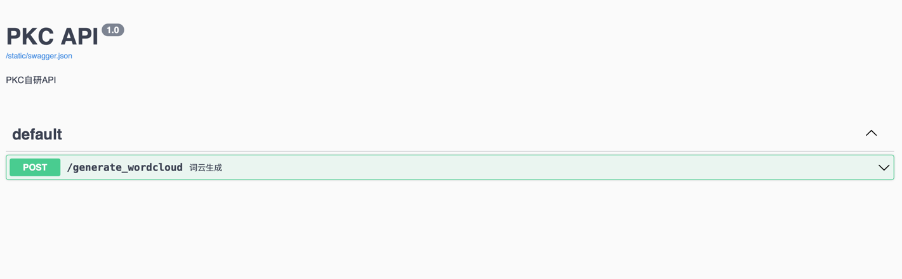

# PKC-API
PKC自用API:
- 1.词云API
- 2.....

## Ⅰ.搭建PKC-API
### 方式一：Docker一键部署
```bash
docker run -d --name pkc-api -p 80:80 curtinlv/pkc-api
```

### 方式二：Docker-compose部署
建立文件`docker-compose.yaml`，文件内容以下：
```yaml
version: '3'
services:
  pkc-api:
    image: curtinlv/pkc-api
    container_name: pkc-api
    ports:
      - "80:80"
    restart: unless-stopped
```
启动
```bash
docker-compose up -d
```
## Ⅱ.Swagger API调试页面
```html
http://ip/swagger
```
